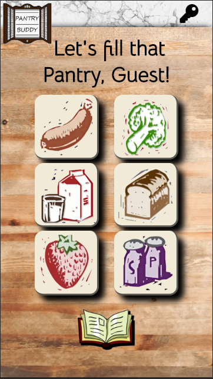
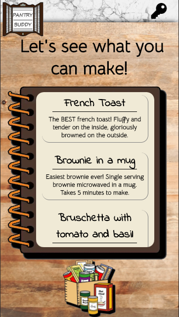
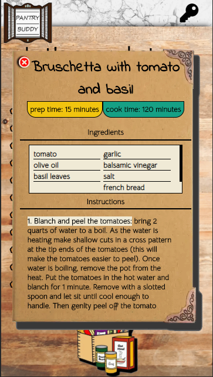

# Recipe Me

> A new project for taking what ingredients the user has on hand and returning all the recipes they are able to make with those ingredients.

## Motivation

> Sometimes I've just wanted to know what I could cook with what I have on hand. I couldn't find a good site that met this need, so I decided to try my hand at it.

## Build Status

## Screen Shots

Landing:

Pantry:

Recipes:

Recipe Card:

## Built with:

* HTML
* CSS
* JS
* ReactJS
* Enzyme
* JWT

## Features:

* Register to save your pantry
* Select the ingredients you have on hand
* See what recipes you can start making
* Tour sample recipes to get the flavor of the App

## Live:

- [Live](https://pantry-buddy.com)

## Author:
* **Ben Sumser**